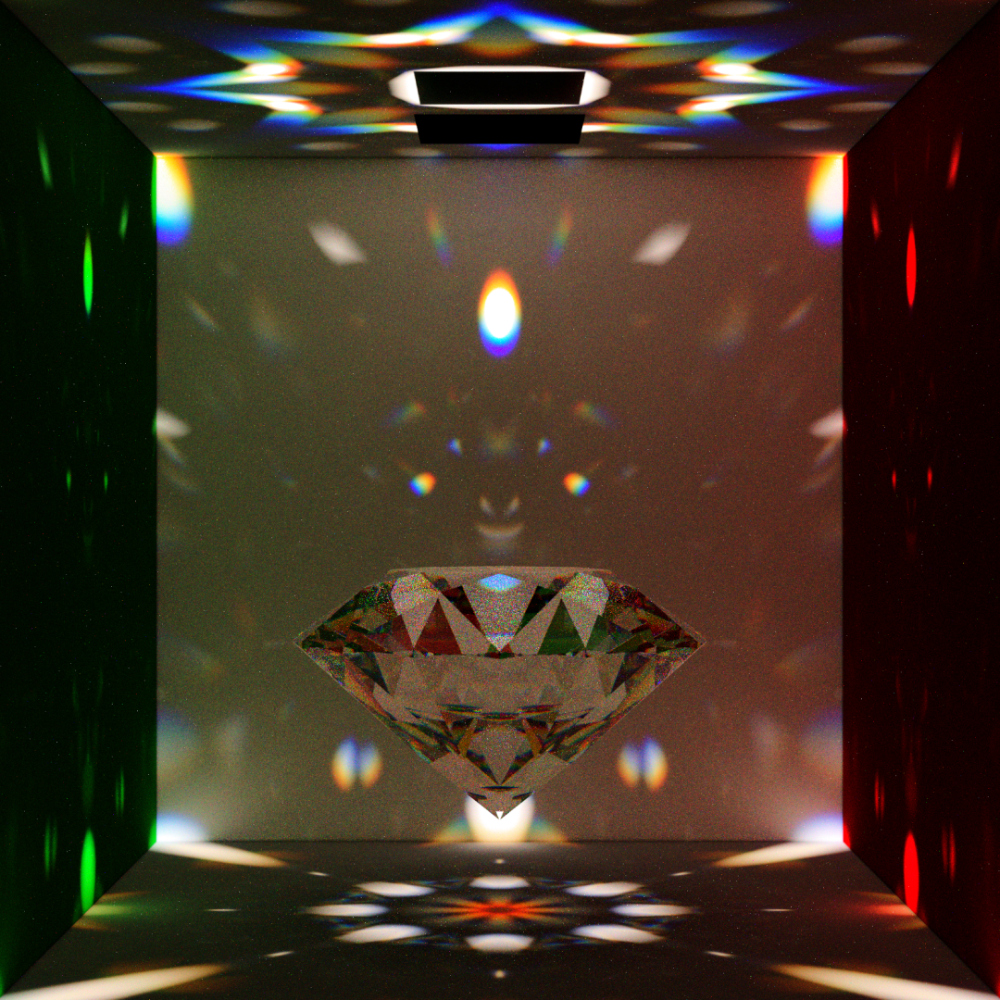

# Rust Pathtracer (placeholder name)

This is a wavelength aware physically based 3D rendering engine written in Rust. The main focus is in implementing concepts in a concise and readable manner, however there are some performance optimizations. This project uses `packed_simd` in much of the code where possible.

The purpose is to help me become more familiar with Rust and with general Light Transport algorithms. However if it helps the reader learn more about these concepts, that would be great.

The following is an image rendered with the BDPT integrator. The light at the top appears dark because it's emitting mainly in the downward direction. The walls' color uses the spectral data from the cornell website. The gem's material information matches that of moissanite, from [refractiveindex.info](https://refractiveindex.info). The color noise is from the fact that this version of the bdpt integrator doesn't use HWSS, and from the fact that most of the illumination into the scene is split into very colorful caustics which overall increase color variance.

See [this](./showcase.md) for some more renders and details

Most of the integrators use NEE and MIS, and they trace using single wavelength sampling.

Supported integrators:

* [Path Tracing](src/integrator/pt.rs), described on wikipedia [here](https://en.wikipedia.org/wiki/Path_tracing)

Experimental integrators:

* [Light tracing](src/integrator/lt.rs), also known as particle tracing, where light is emitted from light sources in the scene and traced until it hits the camera.
* [Bidirectional Path Tracing](src/integrator/bdpt/mod.rs), described in PBRT [here](http://www.pbr-book.org/3ed-2018/Light_Transport_III_Bidirectional_Methods/Bidirectional_Path_Tracing.html)

In addition, much of the code emphasizes matching reality as closely as possible, including the following features:

* Output format:
  * The renderer outputs an .exr file in Linear RGB space, and a .png file in sRGB space.
    * custom exposure values for the sRGB tonemapper are supported. the default behavior is to set the brightest pixel on the screen to white.
* Colors and Lights:
  * Colors on the film are represented in [CIE XYZ](https://en.wikipedia.org/wiki/CIE_1931_color_space) color space. This is then tonemapped to linear RGB space and sRGB space according to the [wikipedia article](https://en.wikipedia.org/wiki/SRGB)
  * Lights can have physically correct spectral power distribution functions, including blackbody distributions and distributions with peaks at certain frequencies
  * Colors are implemented as Spectral Response Functions, under the hood they are bounded spectral power distributions
  * in general, for lights and for colors, those spectral response functions are implemented as curves, and multiple curve types are supported. see [curves.rs](src/curves.rs) and [math/spectral.rs](src/math/spectral.rs) for more information. See also [rust_cg_math](https://github.com/gillett-hernandez/rust_cg_math)
* Metals and Dielectrics are wavelength-dependent:
  * Dielectrics use a curve to represent their varying index of refraction with respect to wavelength.
    * This allows for physically correct Dispersion. The curve used is typically a curve matching the first two terms of [Cauchy's equation](https://en.wikipedia.org/wiki/Cauchy%27s_equation).
  * Metals use multiple curves to represent their index of refraction and extinction coefficient with respect to wavelength.
    * This allows for physically correct color and reflectance behavior so that Gold, Copper, and other metals can be represented and traced accurately.

However, there are some concepts that I'm still unfamiliar with or that I'm working on that aren't properly implemented yet. that includes the following:

* Image reconstruction theory and pixel filtering. this seems to be very important for Light tracing, but less important for normal Path tracing.
* Real physical units for Radiance and for Camera importance.

## Installing and running

Requirements are Rust nightly.

Building and running should be as simple as executing `cargo run` from the shell while in the project root directory.

to change render settings, modify the provided file at data/config.toml

it comes preloaded with many options and most are commented out.

## To Do: an incomplete list

* [x] implement basic config file to reduce unnecessary recompilations. Done, at [config.rs](src/config.rs), data files at [data/config.toml](data/config.toml)
* [x] add simple random walk abstraction. Done, at [integrator/bdpt/helpers.rs](src/integrator/bdpt/helpers.rs)
* [x] implement glossy and transmissive bsdfs. Done, implemented GGX, at [materials/ggx.rs](src/materials/ggx.rs)
* [x] add common color spectral reflectance functions. Done, implemented at [curves.rs](src/curves.rs)
* [x] implement correct XYZ to sRGB conversion. Done, at [tonemap.rs](src/tonemap.rs)
* [x] implement parsing CSV files as curves and using them as ior and kappa values. Done, at [parsing.rs](src/parsing.rs)
* [x] implement instances. Somewhat done, still more to do. at [geometry/mod.rs](src/geometry/mod.rs)
* [x] implement basic accelerator. Done, at [accelerator.rs](src/accelerator.rs)
* [x] implement environment sampling. Mostly done, still more to do (proper pdfs when generating rays from the environment). at [world.rs](src/world/mod.rs) and [environment.rs](src/world/environment.rs)
* [x] implement light emission sampling to generate rays from lights. Done, part of the material trait at [material.rs](src/materials/mod.rs)
* [x] implement BVH
* [x] implement spectral power distribution importance sampling. requires computing the CDF of curves.
* [x] implement scene parser to reduce compilations even more
* [x] implement light tracing
* [x] implement BDPT
* [x] refactor bsdf trait methods to reduce duplication
* [ ] simd based HWSS. WIP on a local branch.
* [ ] basic mediums. WIP on a local branch.
* [ ] implement real units for radiance and camera importance
* [ ] research image reconstruction theory and implement proper pixel filtering

## Credits

Thanks to Nova, for helping me figure out some implementation details and generally helping me learn rust.

I am referencing [this](https://rendering-memo.blogspot.com/2016/03/bidirectional-path-tracing-8-combine.html) blog post and code while working on the BDPT integrator, so thanks to the author.

Thanks to members of the Rendering & Lighting (offline) discord server for pointing me in the right direction in fixing some color output issues.

I used [this](https://github.com/svenstaro/bvh) to implement the BVH, so thanks to [svenstaro](https://github.com/svenstaro). I modified it to use my AABB implementation and other math routines, but for the most part the algorithm is unchanged.

I grabbed some sRGB basis functions for upsampling textures from [this](https://github.com/imallett/simple-spectral) paper/repo. Thanks to the authors.

## Contribution

Please view this as a hobby or reference implementation. If you find any issues, please feel free to log them on GitHub's issue tracker, or submit a pull request to fix them :)

## Support the author

If you're so inclined, buy me a coffee at my [ko-fi](https://ko-fi.com/nacly)
