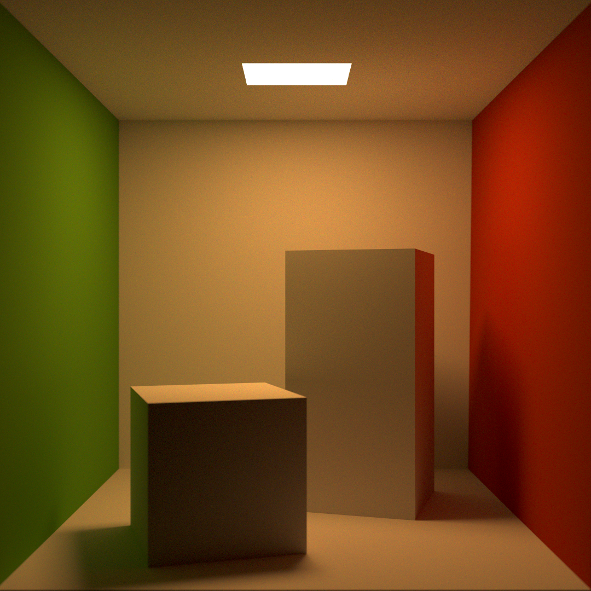
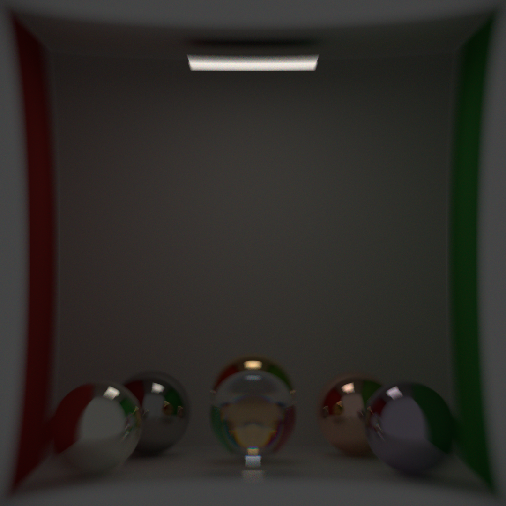
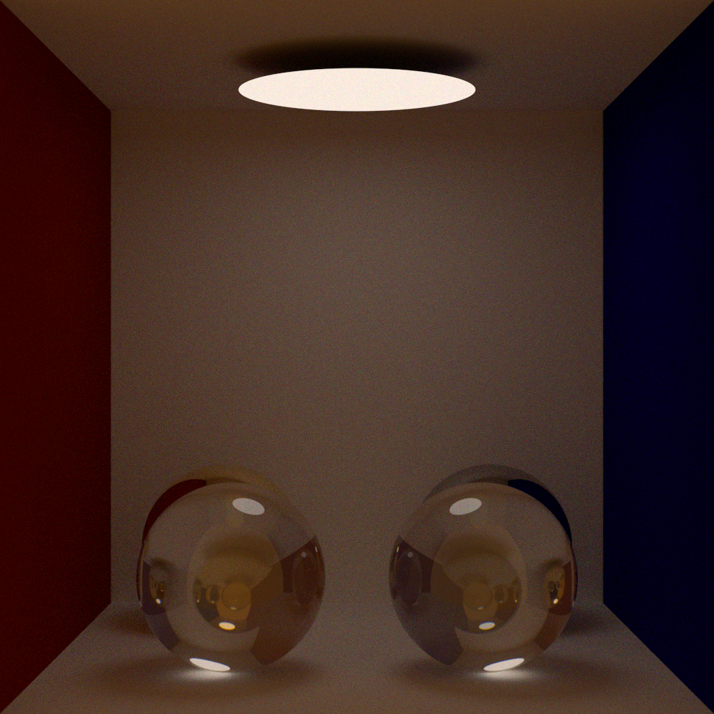

# Showcase of renders

## Latest work

* This render is of the cornell box, using spectral data from the website for the surface reflectances and light spectra, and using the mesh data listed for the boxes. The render is flipped horizontally due to a change in coordinates but this doesn't affect the accuracy of the render. What does affect the accuracy is the fact that this render doesn't use a realistic camera nor camera-specific spectral response functions, instead using the pure cie XYZ color matching functions, thus the white balance is slightly shifted. This could potentially be fixed using a transfer matrix, but I'm not quite sure how. I plan to come back to this once I implement cameras with custom response curves and filters / lenses.

* This render is a PT render that demonstrates multiple materials within an HDRi mapped scene. The hdri in question is [this](https://polyhaven.com/a/kiara_1_dawn) one. Notice the dispersion in the spheres.

* This render is a PT render that is similar to the previous one, however you can clearly see the shadow cast by the moon in this image, demonstrating environment importance sampling. The hdri is[this](https://polyhaven.com/a/moonlit_golf)

* This render is a BDPT render that demonstrates multiple different physically based materials, including copper (back left), lead (front left), iron (back right), platinum (front right), moissanite (middle front), and gold (middle back). all spectral data (iors and extinction coefficients) is from [refractiveindex.info](https://refractiveindex.info)

* This render is a PT render that demonstrates an experimental RealisticCamera implementation that directly traces light through a given lens assembly. It supports an accelerator similar to that found in PBRT's realistic camera implementation, i.e. one that takes advantage of radial symmetry. Notice the shape of the highlights. Note, there is a known bug wherein there doesn't seem to be chromatic aberration.

* This render is the same moissanite gem from the readme, but the original resolution (2160p)

## Early stages

* Back when I was less comfortable working with spectral power distributions. The colors here are made up of a single simple spike in reflectance around 700nm (red) and 450nm (blue). There's also an environment made up of a warm blackbody emitter (about 4000k I'm guessing).
